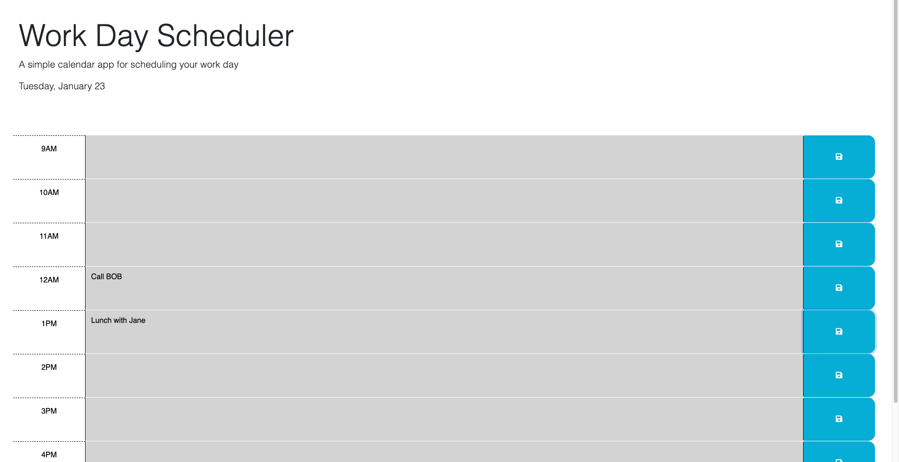

# Work Day Planner

Work Day Scheduler is a simple calendar app for scheduling your workday. It allows users to create a schedule, enter events for specific time blocks, and save them for future reference.

## Table of Contents

- [Description](#description)
- [Features](#features)
- [Getting Started](#getting-started)
- [Usage](#usage)
- [Files and Structure](#files-and-structure)
- [Contributing](#contributing)
- [License](#license)

## Description

The Work Day Scheduler is a user-friendly calendar application designed to help individuals manage their daily work schedules efficiently. This web-based scheduler provides a clear visualization of the day, allowing users to allocate tasks, set reminders, and organize their work hours effectively.

## Features

- Current Day Display: The application prominently displays the current day at the top of the calendar, ensuring users are always oriented to the present date.

- Color-Coded Time Blocks: Time blocks for standard business hours (9 am to 5 pm) are color-coded to provide a quick visual representation of whether each block is in the past, present, or future. This feature aids users in prioritizing and planning their tasks accordingly.

- Event Entry and Saving: Users can seamlessly enter events for specific time blocks by clicking into them. The intuitive interface allows for quick data entry, and a save button ensures that entered events persist.

- Local Storage Persistence: The scheduler utilizes local storage to persistently store and retrieve saved events. This means that even if the user refreshes the page, their entered events will be retained for a seamless and uninterrupted user experience.

## Getting Started

1. Clone the Repository: Begin by cloning the repository to your local machine using the provided Git clone command.

2. Open the Application: Launch the Work Day Scheduler by opening the `index.html` file in your preferred web browser.

3. Efficient Schedule Management: Leverage the features of the scheduler to manage your daily work routine effortlessly. Enter events, save them, and enjoy the benefits of an organized and well-planned workday.

## Usage

The Work Day Scheduler is designed to be straightforward and user-friendly. Follow these steps to effectively use the application:

1. View the Current Day:
   - Upon opening the scheduler, the current day is prominently displayed at the top of the calendar. This helps users stay oriented to the present date.

2. Color-Coded Time Blocks:
   - The time blocks for standard business hours (9 am to 5 pm) are color-coded to indicate whether each block is in the past, present, or future. This visual cue aids users in quickly identifying and prioritizing their tasks.

3. Enter and Save Events:
   - Click on the time block corresponding to the desired hour.
   - Enter your event details in the provided textarea.
   - Click the save button (floppy disk icon) to persistently save the entered event.

4. Local Storage Persistence:
   - The scheduler utilizes local storage to ensure that entered events persist even if the page is refreshed. This allows for a seamless and uninterrupted user experience.

## Files and Structure

- `index.html`: The main HTML file serves as the entry point for the Work Day Scheduler. It provides the structure for the user interface.

- `styles.css`: The stylesheet defines the visual presentation of the scheduler. It includes styling rules for the time blocks, color-coding, and overall aesthetics to enhance the user experience.

- `script.js`: The main JavaScript logic is encapsulated in this file. It handles the dynamic creation of time blocks, color-coding based on the current time, event handling, and the interaction with local storage to persist user-entered events.

- `README.md`: The documentation file you are currently reading. It provides an overview of the project, usage instructions, and details about the project's files and structure.

## Application Preview

[Click here to access the Work Day Scheduler](https://awatson622.github.io/work-day-planner/)

